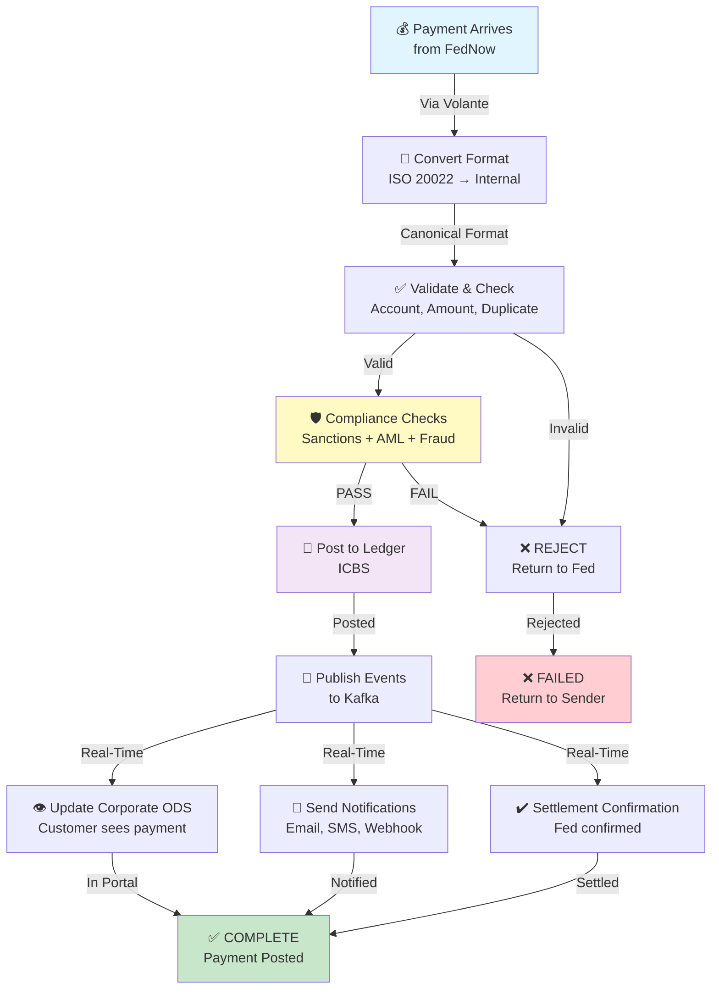
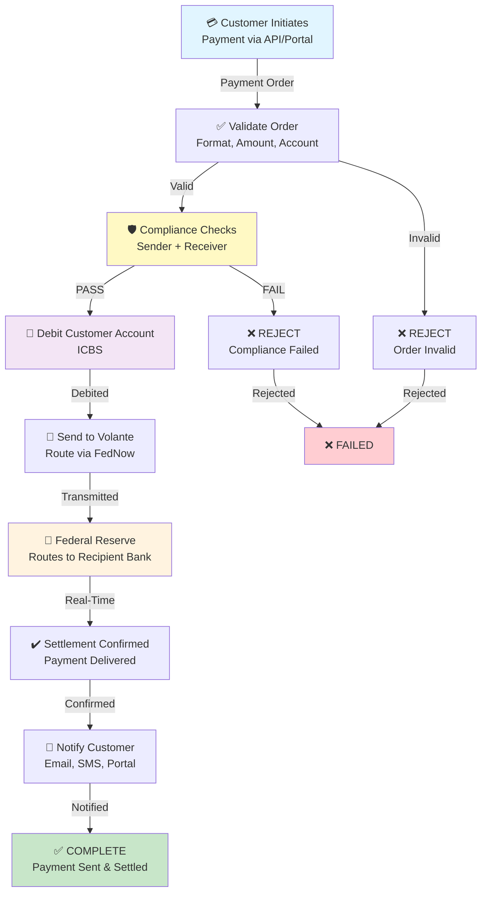
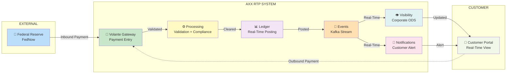
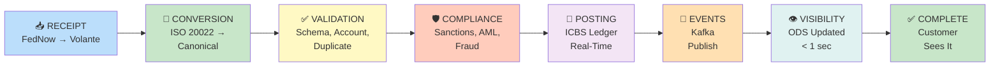
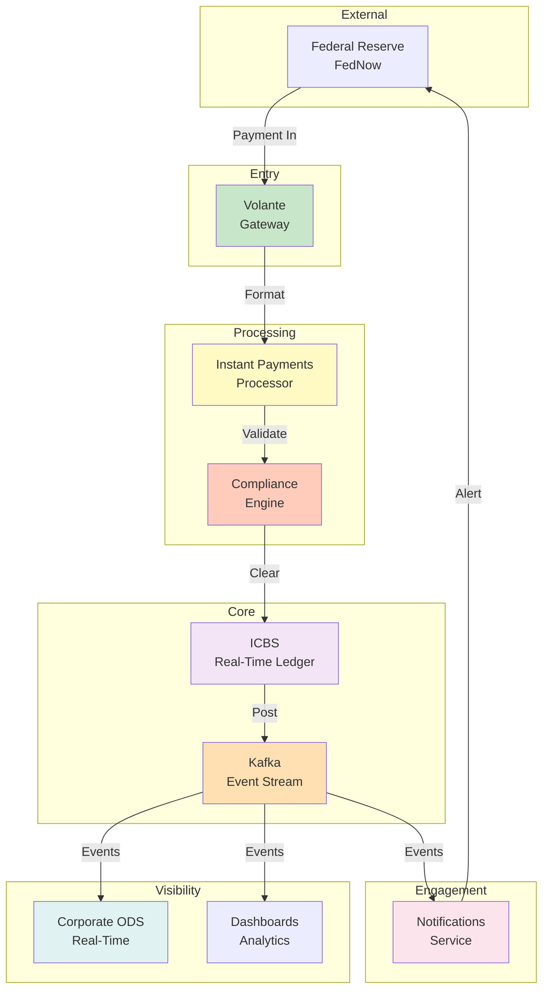
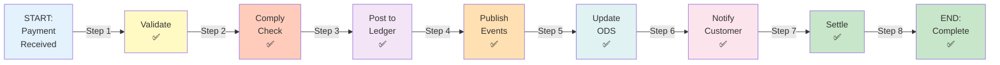
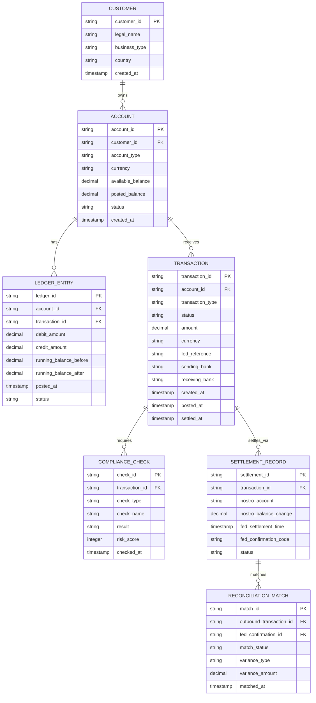
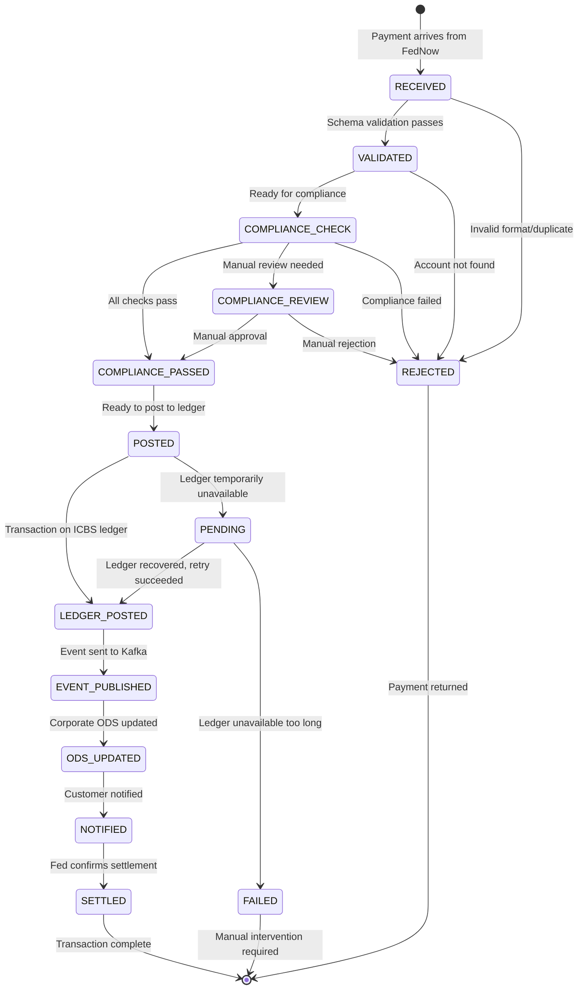

# REAL-TIME PAYMENTS (RTP) SYSTEM - COMPLETE ARCHITECTURE
## AXX Corporate Banking - US Market
**Status:** DRAFT FOR TEAM REVIEW | **Owner:** Principal Engineer | **Date:** 2026-06-27

---

## TABLE OF CONTENTS

1. [Executive Summary](#executive-summary)
2. [Business Context & Scope](#business-context--scope)
3. [Architecture Overview](#architecture-overview)
4. [System Components](#system-components)
5. [High-Level Flows (Visual)](#high-level-flows-visual)
6. [Detailed Payment Flows](#detailed-payment-flows)
7. [Domain Model & Data Architecture](#domain-model--data-architecture)
8. [Technology Stack](#technology-stack)
9. [Security, Reliability & Operations](#security-reliability--operations)
10. [Team Structure & Responsibilities](#team-structure--responsibilities)
11. [Implementation Roadmap](#implementation-roadmap)
12. [Risks & Mitigations](#risks--mitigations)
13. [Architecture Decisions](#architecture-decisions)
14. [Open Questions & TBDs](#open-questions--tbds)
15. [Success Metrics](#success-metrics)

---

## EXECUTIVE SUMMARY

### Vision & Business Case

**Business Opportunity:**
- Real-time payments are now an industry standard capability
- Corporate customers expect instant payment processing and visibility
- Treasury teams require real-time cash position visibility
- Market trend: Faster settlement and immediate confirmation are expected

**Strategic Objective:**
- Implement Real-Time Payments (RTP) system to enable modern payment capabilities
- Integrate with Federal Reserve's FedNow network
- Provide corporate customers with near-instantaneous payment processing and real-time visibility
- Phase 1 (MVP): Inbound RTP — AXX receives payments, posts to customer accounts in real-time
- Phase 2 (Later): Outbound RTP — AXX sends payments on behalf of customers

**Business Value:**
- Customers can see incoming payments immediately (same-second visibility)
- No end-of-day batch delay
- Improves customer cash management and liquidity forecasting
- Provides real-time settlement capability
- Reduces payment uncertainty for customers

**Scope:**
- **Phase 1 MVP:** Inbound RTP (receive payments from FedNow via Volante, post to ledger, provide real-time visibility to customers)
- **Phase 2:** Outbound RTP (customers initiate payments, AXX routes via Volante to FedNow)
- **Out of Scope (for now):** International payments, SWIFT integration, advanced AI/ML analytics

### Success Criteria

| Metric | Target | Notes |
|--------|--------|-------|
| **End-to-End Latency** | < 1 second | From payment receipt to ledger posting |
| **System Availability** | 99.99% | Production SLA |
| **Throughput (Peak)** | [TBD] TPS | Team to define based on FedNow capacity |
| **Compliance Accuracy** | 99.9%+ | Sanctions/AML checks passing legitimate payments |
| **Production Go-Live** | 2027 | Customer enablement date |

### Key Stakeholders

| Role | Name | Responsibility |
|------|------|-----------------|
| **Principal Engineer** | [You] | Technical architecture, team leadership |
| **Product Owner** | Tammy Cheung | Requirements, scope, customer needs |
| **Solution Architect** | Siva Rayankula | Design validation, enterprise alignment |
| **Enterprise Architect** | Andrew Jefferson | System landscape, integration points |
| **Compliance Lead** | [TBD] | Regulatory requirements, audit trail |
| **Security Lead** | [TBD] | Security architecture, data protection |
| **Operations Lead** | [TBD] | Production readiness, 24/7 operations |

---

## BUSINESS CONTEXT & SCOPE

### Competitive Landscape

**Market Context (Current State - June 2026):**
- Major banks have offered RTP capabilities for 5+ years
- Corporate customers increasingly expect real-time payment options
- RTP is becoming standard infrastructure, not a differentiator
- AXX corporate clients actively request RTP capability
- Customer switching risk: Clients moving to competitors for RTP access
- Regulatory/Market pressure: FedNow adoption accelerating across banking industry

**Market Opportunity (Strategic Value for AXX):**
- **Retain Customers:** Stop customer churn to competitors offering RTP
- **Win New Business:** Attract corporate customers requiring RTP capability
- **Increase Revenue:** Higher transaction volumes, premium fees for real-time capability
- **Improve Liquidity Management:** Customers gain real-time cash visibility (working capital reduction)
- **Operational Excellence:** Faster settlement reduces risk and reconciliation effort
- **Competitive Parity:** Match market expectations and regain competitive positioning
- **Treasury Partnerships:** Enable deeper relationships with corporate treasury teams

### Use Cases

#### **Use Case 1: Inbound RTP (Phase 1 - MVP)**

**Scenario:** Corporate customer receives payment from supplier/customer via RTP

**Business Value:**
- Customers see payment immediately (same-second visibility)
- No end-of-day batch delay
- Improves cash management and liquidity forecasting
- Meets market expectations for real-time payment capability
- Reduces customer payment uncertainty

#### **Use Case 2: Outbound RTP (Phase 2)**

**Scenario:** AXX corporate customer initiates RTP payment to external party

**Business Value:**
- Payments delivered in minutes vs. hours/days
- Certainty of delivery (vs. traditional ACH uncertainty)
- 24/7 payment capability (not just business hours)
- Improved cash flow management

#### **Use Case 3: Settlement & Reconciliation**

**Scenario:** End-of-day settlement and reconciliation against Federal Reserve

**Business Value:**
- Immediate settlement finality (no multi-day settlement risk)
- Treasury visibility into actual cash position
- Reduced reconciliation effort (automated matching)

### Regulatory Context

**FedNow (Federal Reserve):**
- FedNow is Federal Reserve's real-time payment system (operating since July 2023)
- Volante integrates with FedNow
- ISO 20022 message standard (PACS/PAIN formats)
- 24/7/365 operation
- Real-time settlement at Federal Reserve

**Compliance Obligations (TBD - Confirm with Compliance):**
- [ ] PCI-DSS: Payment Card Industry requirements
- [ ] SOX: Sarbanes-Oxley audit trail requirements
- [ ] BSA/AML: Bank Secrecy Act / Anti-Money Laundering controls
- [ ] OFAC: Office of Foreign Assets Control - Sanctions screening
- [ ] KYC: Know Your Customer verification
- [ ] Data Residency: Payment data must remain in US
- [ ] Audit Trail: Immutable record of all transactions for 7+ years

---

## ARCHITECTURE OVERVIEW

### Architecture Principles

1. **Real-Time First:** Latency is critical — every decision optimizes for speed while maintaining safety
2. **Fail-Safe:** Never lose a transaction — if uncertain, mark PENDING and alert operations
3. **Modular Integration:** Volante gateway decoupled from internal AXX systems via adapters
4. **Event-Driven:** Kafka events create audit trail and enable real-time data propagation
5. **Compliance-by-Design:** Sanctions/AML/Fraud checks integrated at entry point, not added later
6. **Immutable Ledger:** ICBS is single source of truth for balances — no updates, only appends
7. **Observable:** Comprehensive logging, tracing, monitoring at every step
8. **Scalable by Design:** Built to handle 10x growth in transaction volume

### System Architecture Layers

```
┌─────────────────────────────────────────────────────────────┐
│ EXTERNAL LAYER                                              │
│ FedNow Network | Volante Gateway | Corporate APIs          │
└─────────────────────────────────────────────────────────────┘
                            ↓
┌─────────────────────────────────────────────────────────────┐
│ INGESTION & ADAPTATION LAYER                                │
│ Canonical Adapter (ISO 20022 ↔ Internal Format)            │
└─────────────────────────────────────────────────────────────┘
                            ↓
┌─────────────────────────────────────────────────────────────┐
│ PROCESSING & VALIDATION LAYER                               │
│ Instant Payments Processor | Orchestration | Decisioning   │
└─────────────────────────────────────────────────────────────┘
                            ↓
┌─────────────────────────────────────────────────────────────┐
│ COMPLIANCE & RISK LAYER (PARALLEL)                          │
│ Sanctions | AML (MANTAS) | Fraud Detection (FPP)           │
└─────────────────────────────────────────────────────────────┘
                            ↓
┌─────────────────────────────────────────────────────────────┐
│ LEDGER & SETTLEMENT LAYER                                   │
│ ICBS (Real-Time Ledger) | Transaction Posting              │
└─────────────────────────────────────────────────────────────┘
                            ↓
┌─────────────────────────────────────────────────────────────┐
│ EVENT STREAMING & DATA LAYER                                │
│ Kafka (Event Log) | Event Propagation                      │
└─────────────────────────────────────────────────────────────┘
                            ↓
┌─────────────────────────────────────────────────────────────┐
│ CORPORATE VISIBILITY LAYER                                  │
│ Corporate ODS | Client Servicing | Notifications           │
└─────────────────────────────────────────────────────────────┘
                            ↓
┌─────────────────────────────────────────────────────────────┐
│ REPORTING & OPERATIONS LAYER                                │
│ Analytics | Dashboards | Monitoring | Operations           │
└─────────────────────────────────────────────────────────────┘
```

---

## SYSTEM COMPONENTS

### Component Ownership & Accountability

| Component | Owner | Dependency | Notes |
|-----------|-------|-----------|-------|
| **Volante Gateway** (Vendor) | Team 1 | Critical | Already selected by AXX |
| **Canonical Adapter** | Team 1 | Critical | Converts ISO 20022 ↔ Internal format |
| **Instant Payments Processor** | Team 2 | Critical | Core payment engine |
| **Compliance Engine** | Team 2 | Critical | Sanctions, AML, Fraud checks (parallel) |
| **ICBS Ledger** | Team 3 | Critical | Real-time posting, immutable |
| **Kafka** | Team 3 | Critical | Event streaming, audit trail |
| **Corporate ODS** | Team 3 | Important | Real-time visibility |
| **Notifications Service** | Team 2 | Important | Customer alerts |
| **RecLite** | Team 3 | Important | Reconciliation matching |
| **GTIS** | Team 3 | Important | Network connectivity |
| **BSPB** | Team 3 | Important | Settlement processing |
| **CDS** | Team 3 | Important | Transaction data storage |

---

## RTP STANDARDS COMPLIANCE & CLEARING HOUSE ALIGNMENT

### Overview

AXX' RTP system must comply with The Clearing House (TCH) **RTP Operating Rules** and **RTP Participation Rules**. This section documents how our architecture aligns with TCH standards and integrates with the RTP network infrastructure.

**Key Reference Documents:**
- The Clearing House "Introduction to the RTP® System" (October 2020)
- RTP Operating Rules (available at theclearinghouse.org)
- RTP Participation Rules
- RTP Message Specifications (ISO 20022)
- RTP Settlement Model for Funding Participants

---

### RTP Message Type Mapping (ISO 20022)

**Our system must implement the following RTP message types:**

#### **Payment Messages (Value Exchange)**

| ISO Code | Message Type | Direction | Our System | Notes |
|----------|--------------|-----------|-----------|-------|
| **pacs.008** | Credit Transfer | Sending FI → RTP → Receiving FI | **IMPLEMENT (MVP)** | Core payment message; contains funds transfer instruction |
| **pacs.009** | FI-to-FI Credit Transfer | FI → FI (via RTP) | Phase 2+ | For inter-FI liquidity transfers during Fedwire closure |
| **pacs.002** | Message Status Report | Receiving FI → RTP → Sending FI | **IMPLEMENT (MVP)** | Response to pacs.008; indicates accept/reject |

#### **Payment-Related Messages (Non-value)**

| ISO Code | Message Type | Direction | Our System | Notes |
|----------|--------------|-----------|-----------|-------|
| **pain.013** | Request for Payment (RFP) | Payee FI → RTP → Payer FI | Phase 2+ | Payee requests payment from Payer |
| **pain.014** | Response to RFP (RFPR) | Payer FI → RTP → Payee FI | Phase 2+ | Payer acknowledges RFP (accept/reject/schedule) |
| **camt.056** | Request for Return of Funds (RFR) | Payer FI → RTP → Payee FI | Phase 2+ | Request refund for unauthorized/erroneous payment |
| **camt.029** | Response to RFR (RFRR) | Payee FI → RTP → Payer FI | Phase 2+ | Payee acknowledges RFR (will return / won't return / partial) |
| **camt.026** | Request for Information (RFI) | Either → RTP → Either | Phase 2+ | Request additional payment details (invoice #, etc.) |
| **camt.028** | Response to RFI (RFIR) | Payee → RTP → Payer | Phase 2+ | Answer to RFI with requested information |
| **camt.035** | Payment Acknowledgement | Payee FI → RTP → Payer FI | Optional | Payee confirms receipt and provides feedback |
| **remt.001** | Remittance Advice | Payer FI → RTP → Payee FI | Optional | Detailed invoice/remittance information about payment |

#### **Control Messages (System-Level)**

| ISO Code | Message Type | Direction | Our System | Notes |
|----------|--------------|-----------|-----------|-------|
| **admn.001** | Participant Sign-on Request | Our system → RTP | **IMPLEMENT** | Register with RTP network at startup |
| **admn.002** | Participant Sign-on Response | RTP → Our system | **IMPLEMENT** | RTP confirms we're online |
| **admn.003** | Participant Sign-off Request | Our system → RTP | **IMPLEMENT** | Unregister from RTP network for maintenance |
| **admn.004** | Participant Sign-off Response | RTP → Our system | **IMPLEMENT** | RTP confirms we're offline |
| **admn.005** | Echo Request | RTP ↔ Our system | **IMPLEMENT** | Heartbeat (every 30 seconds of inactivity) |
| **admn.006** | Echo Response | Our system → RTP | **IMPLEMENT** | Confirm we're still online |
| **admn.007** | Database Availability Report Request | Our system → RTP | Optional | Request list of unavailable participants |
| **admn.008** | Database Availability Report Response | RTP → Our system | Optional | Response with unavailable participant list |

#### **System Notification Messages (SNM - admi.004 with Event Codes)**

| Event Code | SNM Type | From | To | Our System Handling |
|------------|----------|------|-----|-------------------|
| **960** | Connectivity Status Broadcast | RTP | All Participants | MONITOR — Other banks online/offline |
| **971** | System Status Broadcast | RTP | All Participants | MONITOR — RTP suspended/available |
| **972** | Participant Suspend Broadcast | RTP | All Participants | MONITOR — A participant suspended |
| **975** | Settlement Individual Transaction Limit (SITL) Change | RTP | All Participants | MONITOR — $10M limit change notification |
| **976** | Security Transaction Limit (STL) Change | RTP | All Participants | MONITOR — Payment limit changed |
| **981** | Free Format Broadcast/Notification | RTP | One/All | MONITOR — Operator message |
| **982** | Participant Status | RTP | All Participants | MONITOR — A participant signed on/off |
| **993** | Available Prefunded Balance Warning | RTP | Specific | **IMPLEMENT** — Our liquidity low alert |
| **994** | Available Prefunded Balance Breach | RTP | Specific | **IMPLEMENT** — Payment rejected due to insufficient funds |
| **996** | Prefunded Requirement Change | RTP | Specific | **IMPLEMENT** — Our minimum balance changed |
| **998** | Prefunded Balance Change | RTP | Specific | **IMPLEMENT** — Our balance updated (funding/disbursement) |
| **999** | Reconciliation Status | RTP | All Participants | **IMPLEMENT** — New reconciliation window opened |

---

### RTP Participation Model: Prefunded Balance Account

**Critical: RTP Settlement Model** 

RTP does NOT use traditional interbank settlement (like Fedwire). Instead, it uses a **Prefunded Balance Account** held at the Federal Reserve Bank of New York (FRBNY).

#### **How Prefunded Settlement Works:**

```
┌─────────────────────────────────────────────────────────────┐
│ FEDERAL RESERVE BANK OF NEW YORK                            │
│ ┌─────────────────────────────────────────────────────────┐ │
│ │ PREFUNDED BALANCE ACCOUNT (Shared by all Participants) │ │
│ │ - Owned jointly by all Funding Participants            │ │
│ │ - TCH is sole agent                                    │ │
│ │ - Single shared account (not individual accounts)      │ │
│ └─────────────────────────────────────────────────────────┘ │
└─────────────────────────────────────────────────────────────┘
         ↑                                           ↓
         │ Supplemental Funding (Fedwire)           │ Disbursements
         │                                           │
    ┌────┴────────────────────────────────────────────┴────┐
    │                                                      │
┌───┴───┐              ┌──────────┐              ┌───┴───┐ │
│AXX├─ Prefunded ─┤   RTP    ├─ Prefunded ─┤  Other│ │
│   (us) │ Position A  │ Settlement│ Position B  │ Banks │ │
└────────┘            └──────────┘             └────────┘ │
    ↑                        ↓                       ↓      │
Current Prefunded         Immediate                Settlement
Position: $50M           Settlement            occurs instantly
         ↓                                      by moving prefunded
Nostro at FRBNY        When CT accepted:    positions between
         │          - Deduct from Payer     Sending & Receiving
         │          - Add to Payee          Participant accounts
         │          - (within Prefunded
         │            Balance Account)
         │
    ┌────┴───────────────────────────────────────────────┐
    │ AXX RECONCILIATION                            │
    │ ┌──────────────────────────────────────────────────┤
    │ │ Opening Prefunded Position (start of window): $50M
    │ │ + Supplemental Funding received:              +$10M
    │ │ - Credit Transfers sent:                       -$8M
    │ │ + Credit Transfers received:                   +$5M
    │ │ ───────────────────────────────────────────────────
    │ │ Closing Prefunded Position (end of window):   $57M
    │ │ (= Opening position for next window)
    │ └──────────────────────────────────────────────────┘
    └─────────────────────────────────────────────────────┘
```

#### **Key Prefunded Balance Concepts:**

| Term | Definition | AXX Role | Constraint |
|------|-----------|---------------|-----------|
| **Prefunded Requirement** | Minimum balance TCH requires us to maintain in Prefunded Balance Account before we can send payments | SENDING PARTICIPANT | Must be >= TCH minimum (varies by size/profile) |
| **Current Prefunded Position** | Our current balance in Prefunded Balance Account | Real-time tracking | Cannot drop below $0 (payments rejected if would) |
| **Opening Prefunded Position** | Our position at start of reconciliation window | Carries forward from prior window | Set when window closes |
| **Excess Liquidity** | Amount above Prefunded Requirement that we can request back | = Current Position - Prefunded Requirement | Subject to business rules |
| **Supplemental Funding** | Additional funds we transfer to Prefunded Balance Account via Fedwire | During Fedwire hours (9 PM - 6 PM ET) | Increases our position immediately |
| **Disbursement** | Request to withdraw excess liquidity from Prefunded Balance Account via Fedwire | During Fedwire hours (9 PM - 6 PM ET) | Subject to TCH approval of "excess" calculation |
| **Funding Agent** | Optional third party (another bank) that manages our liquidity on our behalf | OPTIONAL | Handles supplemental funding & disbursement requests |
| **Reconciliation Window** | Period (typically hourly) for tracking payments and settlement | At window cutover, new Opening Position set | Serves as accounting period |

---

### Settlement Mechanics: Real-Time & Final

**When AXX receives a credit transfer (inbound RTP):**

```
STEP 1: Receiving Participant (AXX) accepts message
  └─→ STEP 2: RTP System immediately SETTLES:
              - Decreases Sending Participant's Current Prefunded Position
              - Increases OUR Current Prefunded Position (in Prefunded Balance Account)
              └─→ STEP 3: RTP sends us "Message Receiver Confirmation" (5th leg)
                         ├─ Confirms settlement is FINAL & IRREVOCABLE
                         └─ We MUST immediately post funds to customer account
              └─→ STEP 4: We post to ICBS ledger (real-time)
              └─→ STEP 5: Publish events to Kafka
              └─→ STEP 6: Update Corporate ODS (customer sees it)
              └─→ STEP 7: Send notifications
```

**KEY: By the time AXX receives confirmation in Step 3, the settlement is COMPLETE and FINAL.**
- No reversals possible (except via RFR - Request for Return of Funds)
- No debit-hold (payment is 100% certain)
- Funds are ours immediately

---

### Transaction Limits

**RTP Current Limit:**
- **Maximum per transaction: $10 million**
- Applies to all credit transfers (pacs.008)
- System-wide limit (same for all participants)
- Communicated via SNM Event Code 975/976 if changed

**Our Validation:**
- Must validate all incoming/outgoing payments against $10M limit
- Reject any payment > $10M with appropriate reason code
- Document in compliance checks

---

### Reconciliation Windows

**RTP segments the day into reconciliation windows for settlement tracking:**

```
RTP DAY STRUCTURE:
├─ Window 1: 12:00 AM - 1:00 AM (example: hourly windows)
├─ Window 2: 1:00 AM - 2:00 AM
├─ Window 3: 2:00 AM - 3:00 AM
├─ ...
└─ Window N: 11:00 PM - 12:00 AM

AT EACH WINDOW CUTOVER:
  ├─ Previous window closes
  ├─ RTP sends Reconciliation Status SNM (Event Code 999) to all participants
  ├─ SNM includes:
  │  ├─ Previous (Closed) Reconciliation Window ID
  │  ├─ New (Open) Reconciliation Window ID
  │  ├─ Opening Prefunded Position for next window
  │  ├─ # and value of CTs sent/received in prior window
  │  └─ # and value of funding/disbursements in prior window
  └─ New window opens with fresh "Net Position" (starts at $0)

NET POSITION (within a window):
  = Sum of all increases/decreases from:
    - CTs sent (decrease)
    - CTs received (increase)
    - Supplemental funding (increase)
    - Disbursements (decrease)
```

**Our System Must:**
- Track all transactions by reconciliation window ID
- Maintain separate Net Position calculations per window
- Receive and process reconciliation SNMs (999) at window cutover
- Produce reconciliation reports matching RTP totals
- Track Opening Prefunded Position (from RTP notification)

---

### Control Message Flow (Sign-On/Sign-Off)

**Daily Startup Sequence:**

```
T=00:00 - AXX SYSTEMS START
  │
  ├─→ Initialize RTP connection to TCH
  │
  ├─→ Send Participant Sign-on Request (admn.001)
  │   ├─ Participant ID: [AXX RTP ID]
  │   ├─ Connection ID: [Our connection identifier]
  │   └─ Timestamp
  │
  ├─→ RTP responds with Sign-on Response (admn.002)
  │   └─ Status: SUCCESS (or ERROR code)
  │
  ├─→ RTP broadcasts our status to all other participants
  │   └─ SNM Event Code 982: "Participant Status" (now AVAILABLE)
  │
  └─→ AXX now READY TO SEND/RECEIVE payments
      ├─ RTP will send periodic Echo Requests (admn.005)
      ├─ We must respond with Echo Response (admn.006) within 30 seconds
      └─ If we miss 3 consecutive echoes, RTP marks us UNAVAILABLE

MAINTENANCE/SHUTDOWN:
  └─→ Send Participant Sign-off Request (admn.003)
      ├─ RTP responds with Sign-off Response (admn.004)
      ├─ RTP broadcasts to all others
      └─ We now UNAVAILABLE to receive payments
          (but existing payments may still be processed)
```

**Our System Must Implement:**
- ✅ Send admn.001 on startup
- ✅ Handle admn.002 response (confirm registration success)
- ✅ Respond to admn.005 (Echo Request) within SLA
- ✅ Send admn.003 on graceful shutdown
- ✅ Monitor admi.004 SNMs for availability changes
- ✅ Alert operations if 3 consecutive echoes fail

---

### Funding Model: Prefunded vs. Funding Agent

**Option 1: Direct Prefunding (AXX manages own liquidity)**
```
AXX Treasury
    │
    ├─ Monitor own prefunded position (via RTP Management Portal)
    ├─ Send Supplemental Funding via Fedwire (9 PM - 6 PM ET) when low
    ├─ Request Disbursements when we have excess liquidity
    └─ Manage Prefunded Requirement compliance
```

**Option 2: Funding Agent (Third-party manages liquidity)**
```
AXX Treasury
    │
    └─ Agreement with Funding Agent (another bank or service provider)
       │
       └─ Funding Agent handles:
          ├─ Monitoring our position
          ├─ Sending Supplemental Funding on our behalf
          ├─ Requesting Disbursements on our behalf
          └─ Tracking our liquidity

RTP receives requests from Funding Agent, not directly from us.
```

**AXX Decision (TBD):**
- [ ] Direct Prefunding (simpler, we control)
- [ ] Funding Agent (less operational burden, depends on third party)

**Impact on Our Architecture:**
- Direct: Operations team monitors dashboard, triggers funding requests
- Funding Agent: Coordinate with agent; they handle liquidity

---

### RTP Operating Rules Compliance Checklist

**By AXX/Volante at Implementation:**

| Rule | Requirement | Our Architecture | Status |
|------|-------------|------------------|--------|
| **Payment Finality** | All RTP payments are FINAL once accepted by receiving FI; cannot be revoked | Immutable ledger, no updates | ✅ DESIGNED |
| **Immediate Availability** | Receiving FI MUST make funds available immediately to customer | Post to ICBS + ODS in < 1 sec | ✅ DESIGNED |
| **Message Status Report** | Must respond to every pacs.008 with pacs.002 (accept/reject) within time-out | Validation engine + response handler | ✅ TO IMPLEMENT |
| **Request for Return** | If customer claims unauthorized payment, must respond to RFR within 10 business days | RFR handling workflow | ⚠️ PHASE 2 |
| **Fraud Investigation** | For claimed fraud RFR, may take longer than 10 days for investigation | RFR handling with investigation SLA | ⚠️ PHASE 2 |
| **Prefunded Balance** | Cannot send payments if Current Prefunded Position would drop below $0 | Prefunded position check before posting | ✅ TO IMPLEMENT |
| **Sign-on/Sign-off** | Must sign on (admn.001) before sending, sign off (admn.003) when done | Control message handling | ✅ TO IMPLEMENT |
| **Echo Response** | Must respond to Echo Requests (admn.005) within SLA; 3 misses = unavailable | Heartbeat monitoring | ✅ TO IMPLEMENT |
| **Compliance Checks** | Must perform all compliance/AML/sanctions checks per TCH requirements | Compliance engine | ✅ DESIGNED |
| **Data Privacy** | Support tokenization of account credentials | Token notification (camt.022) Phase 2+ | ⚠️ FUTURE |
| **Audit Trail** | Maintain immutable log of all transactions (7+ years) | Kafka + CDS | ✅ DESIGNED |
| **Account Validation** | Verify account exists and is active before accepting payments | Validation engine | ✅ TO IMPLEMENT |
| **Duplicate Detection** | Reject duplicate transactions (same Transaction ID) | Duplicate checking logic | ✅ TO IMPLEMENT |

---

### RTP Message Flows in Our Architecture

**Inbound Credit Transfer Event (5 Legs):**

```
LEG 1 (SENDING PARTICIPANT → RTP):
  └─ Payer's FI sends pacs.008 (Credit Transfer) to RTP

LEG 2 (RTP → RECEIVING PARTICIPANT):
  └─ RTP routes pacs.008 to AXX (Payee's FI)
  └─ We validate format, business rules, compliance

LEG 3 (RECEIVING PARTICIPANT → RTP):
  └─ AXX sends pacs.002 (Message Status Report)
  └─ Accept or Reject decision
  └─ RTP settles immediately if ACCEPT

LEG 4 (RTP → SENDING PARTICIPANT):
  └─ RTP routes pacs.002 response back to Payer's FI
  └─ Payer's FI informs Payer of result

LEG 5 (RTP → RECEIVING PARTICIPANT):
  └─ RTP sends Message Receiver Confirmation (pacs.002)
  └─ Confirms we accepted the response within time-out
  └─ Settlement is FINAL & IRREVOCABLE
  └─ We MUST post to ledger immediately
```

---

### TCH Governance & Regulation

**How RTP is Governed:**

| Governance Body | Role | Impact on Us |
|-----------------|------|-------------|
| **The Clearing House (TCH)** | Operates RTP network, sets rules | We comply with RTP Operating Rules |
| **Federal Reserve** | Holds Prefunded Balance Account at FRBNY | Settlement via Fed account; 24/7 operations |
| **FFIEC** | Oversees TCH as Significant Service Provider (SSP) | TCH examined annually; we subject to audit |
| **Federal Reserve (Title VIII)** | TCH designated as systemically important utility (SIFMU) | Enhanced supervision; strict requirements |
| **RTP Business Committee** | Sets RTP policy, approves rule changes | Rules we must follow |
| **AXX Internal** | Risk, Compliance, Legal approval | Internal governance applied to RTP |

**Our Compliance Approach:**
- ✅ Implement per RTP Operating Rules
- ✅ Maintain audit trail (7+ years)
- ✅ Report to regulators (Fed, OCC, FDIC)
- ✅ Support TCH examinations
- ✅ Follow all Operating Rules changes/updates

---

### Standards References

**Primary RTP Documentation (from The Clearing House):**
- Introduction to the RTP® System (October 2020) — **[WE HAVE THIS]**
- RTP Participation Rules — [TBD: PE to obtain]
- RTP Operating Rules — [TBD: PE to obtain]
- RTP Message Specifications (ISO 20022 details) — [TBD: PE to obtain]
- RTP Settlement Model for Funding Participants — [TBD: PE to obtain]
- RTP Prefunded Requirement Documentation — [TBD: PE to obtain]
- Risk Management and Fraud Control Requirements — [TBD: PE to obtain]
- Information Security Standards and Requirements — [TBD: PE to obtain]

**International Standards:**
- ISO 20022: Financial messaging standard (pacs, pain, camt, admn, remt, acmt message types)
- UCC 4A: Uniform Commercial Code § 4A (fund transfers; RTP applies key UCC 4A concepts)

---

### Open Questions for Clearing House/RTP Team

- [ ] What is AXX' specific Prefunded Requirement amount?
- [ ] Should we use Direct Prefunding or Funding Agent model?
- [ ] What reconciliation window frequency (hourly? half-hourly?)?
- [ ] Are there custom compliance rules beyond standard AML/sanctions?
- [ ] What is the timeout SLA for message responses?
- [ ] Do we need to support payment status request (pacs.028 - planned 2020)?
- [ ] Will we participate in token notification (camt.022 - planned 2020)?
- [ ] What is AXX' RTP Participant ID from TCH?
- [ ] Connection routing: Direct to TCH or via TPSP?
- [ ] Fedwire account details for supplemental funding/disbursements?

---


| Component | Current/New | Purpose | Team Owner | Status |
|-----------|------------|---------|-----------|--------|
| **Volante Gateway** | Vendor (New) | Receives payments from FedNow | Team 1 | [TBD: MIA details] |
| **ICBS (Ledger)** | Existing (Modified) | Real-time ledger, balance updates | Team 3 | [TBD: Integration readiness] |
| **Instant Payments Processor** | New | Payment validation, orchestration | Team 2 | [TBD: Build vs. buy] |
| **Kafka** | New | Event streaming, audit trail | Team 3 | [TBD: Deployment model] |
| **Corporate ODS** | Existing (Enhanced) | Real-time customer visibility | Team 3 | [TBD: Data model changes] |

**SUPPORTING COMPONENTS (Phase 1 MVP):**

| Component | Purpose | Team Owner | Impact |
|-----------|---------|-----------|--------|
| **Sanctions Screening** | OFAC compliance | Team 2 | Required for regulatory compliance |
| **AML Detection (MANTAS)** | Transaction monitoring | Team 2 | Required for regulatory compliance |
| **Fraud Detection (FPP)** | Real-time fraud checks | Team 2 | Prevents fraudulent payments |
| **CDS** | Transaction data storage | Team 3 | Stores transaction details for history |
| **Notifications Service** | Customer notifications | Team 2 | Sends payment status updates |
| **RecLite** | Reconciliation matching | Team 3 | Matches payments vs. Fed confirmations |
| **GTIS** | Network/infrastructure | Team 3 | Provides connectivity |
| **Monitoring & Alerting** | Operations | Team 3 | Monitors system health |

---

## HIGH-LEVEL FLOWS (VISUAL)

### 1. INBOUND RTP - HIGH LEVEL FLOW



### 2. OUTBOUND RTP - HIGH LEVEL FLOW



### 3. OVERALL RTP SYSTEM FLOW



### 4. PAYMENT PROCESSING PIPELINE



### 5. COMPONENT INTERACTION - SIMPLIFIED



### 6. TRANSACTION JOURNEY - SIMPLIFIED



---

## DETAILED PAYMENT FLOWS

### INBOUND RTP FLOW - DETAILED (9 Steps)

**"Payment arrives from FedNow → AXX customer sees it in real-time"**

#### **STEP 1: PAYMENT RECEIPT & ENTRY**

Payment arrives from FedNow via Volante Gateway
- **Data Received:** ISO 20022 format (PACS message)
- **Volante processes:**
  - Decrypts/validates signature
  - Checks message integrity
  - Publishes: `RTP_INBOUND_RECEIVED` event to Kafka

#### **STEP 2: FORMAT ADAPTATION**

Canonical Adapter converts ISO 20022 to internal format
- **Input:** ISO 20022 PACS.008 (Funds Transfer)
- **Output:** Canonical format (internal representation)
- **Validates:** Schema compliance, account format, amount validation, duplicate detection

#### **STEP 3: VALIDATION & ORCHESTRATION**

Instant Payments Processor validates transaction
- **Checks:**
  - Account exists in AXX
  - Account is active (not closed, suspended)
  - Amount within limits
  - Not a duplicate
- **SLA Timer Started:** Target < 1 second to ledger posting
- **Publishes:** `RTP_VALIDATED` event

#### **STEP 4: COMPLIANCE CHECKS (PARALLEL)**

All 3 checks run in PARALLEL for speed:

**Sanctions Screening (50ms):**
- Check sender against OFAC list
- Result: PASS / FAIL / REVIEW

**AML Detection - MANTAS (100ms):**
- Threshold monitoring
- Behavioral pattern analysis
- Risk scoring
- Result: PASS / FAIL / REVIEW

**Fraud Detection - FPP (75ms):**
- Account velocity check
- Amount anomaly detection
- Behavioral change detection
- Result: PASS / FAIL / REVIEW

**Decision:** All must PASS or payment is REJECTED

#### **STEP 5: REAL-TIME LEDGER POSTING (ICBS)**

ICBS posts transaction (atomic - all or nothing)
- **Debit:** Nostro account
- **Credit:** Customer account
- **Update:** Running balance
- **Timing:** < 100ms
- **Immutability:** Ledger entry cannot be changed

#### **STEP 6: EVENT STREAM & PROPAGATION**

Kafka publishes `RTP_LEDGER_POSTED` event
- **Timing:** < 100ms after ledger posting
- **Subscribers:** All consume in parallel

#### **STEP 7: CORPORATE ODS UPDATE**

Corporate ODS updated in real-time
- **Balance:** Updated to reflect new amount
- **Transaction:** Added to history
- **Settlement Status:** Updated
- **Timing:** < 1 second

#### **STEP 8: NOTIFICATIONS**

Notifications Service sends:
- Email: "Payment received - $50,000"
- SMS: "$50K payment received. Balance: $1.05M"
- Webhook: POST to customer system
- In-app: Push notification
- **Timing:** < 5 seconds

#### **STEP 9: SETTLEMENT & RECONCILIATION**

Real-time settlement at Federal Reserve
- **Nostro Account:** Updated immediately
- **Settlement Status:** FINAL (cannot be reversed)
- **Reconciliation:** Matched against FedNow confirmation
- **Treasury Reporting:** Nostro balance reflected in real-time

**TOTAL E2E TIME: ~0.5 seconds**

### ERROR HANDLING & FAILURE SCENARIOS

#### **Scenario 1: Compliance Check FAILS (Sanctions Match)**

→ Payment marked REJECTED
→ Decision: REJECT payment, return to FedNow
→ Compliance Team Notified for investigation
→ AXX notifies customer: "Payment blocked for compliance review"

#### **Scenario 2: Account Validation FAILS (Account Closed)**

→ Payment marked REJECTED
→ Return code sent to FedNow
→ Sending bank receives reject and notifies their customer
→ AXX does NOT notify (account closed)

#### **Scenario 3: Ledger Posting FAILS (Database Issue)**

→ Payment marked PENDING
→ Alert sent to Operations Team (CRITICAL)
→ Manual intervention required:
  - Operations: Retry posting to ICBS
  - If ICBS back online: Post manually
  - If ICBS still down: Hold payment, notify customer
→ Customer impact: Delayed visibility (payment is safe, but not visible yet)

### OUTBOUND RTP FLOW - HIGH LEVEL

Customer initiates payment → Volante → FedNow → Receiving Bank → Settlement

**Brief flow:**
1. Customer submits payment via API/Portal
2. POM validates order
3. Compliance checks (sanctions on sender + receiver, AML)
4. ICBS debits customer account
5. Kafka event published
6. Volante formats and sends to FedNow
7. FedNow delivers to receiving bank (real-time)
8. Settlement confirmed
9. Corporate customer notified (payment delivered)

---

## DOMAIN MODEL & DATA ARCHITECTURE

### Logical Data Model



### Data Storage Strategy

| Data Type | System | Update Frequency | Latency Target | Retention |
|-----------|--------|-----------------|-----------------|-----------|
| **Transaction Record** | CDS | Real-time | < 1 second | 7+ years |
| **Ledger Entry** | ICBS | Real-time | < 100ms | Indefinite (immutable) |
| **Compliance Events** | CDS | Real-time | < 200ms | 7+ years (regulatory) |
| **Real-Time Visibility** | Corporate ODS | Real-time | < 1 second | 30-90 days |
| **Event Log** | Kafka | Real-time | < 100ms | 30 days |
| **Analytics** | Data Lake | Daily/Batch | N/A | Indefinite |
| **Reconciliation** | RecLite DB | Real-time | < 1 second | 7+ years |

### Transaction Lifecycle



---

## TECHNOLOGY STACK

### Platform & Infrastructure

| Layer | Component | Technology | Status | Notes |
|-------|-----------|-----------|--------|-------|
| **Compute** | Application Servers | [TBD: Kubernetes/Docker?] | [TBD] | Deployment model TBD |
| **Container Orchestration** | Orchestration | [TBD: K8s? Cloud?] | [TBD] | Depends on deployment (BCP vs AWS) |
| **Networking** | Gateway/Connectivity | GTIS (AXX existing) | Existing | AXX internal infrastructure |
| **Load Balancing** | API Gateway | [TBD: F5? Nginx?] | [TBD] | Handles RTP + API traffic |
| **Monitoring** | Uptime/Alerting | [TBD: Datadog? Splunk?] | [TBD] | Critical for 99.99% SLA |

### Application Stack

| Layer | Component | Technology | Rationale | Status |
|-------|-----------|-----------|-----------|--------|
| **API Gateway** | REST API for customers | [TBD] | Customer-facing, fast | [TBD] |
| **Payment Processing** | Instant Payments Processor | [TBD] | Core engine, latency-critical | [TBD] |
| **Rules Engine** | Compliance Decisioning | [TBD] | Executes compliance rules | [TBD] |
| **Orchestration** | Workflow Management | [TBD] | Coordinates payment flow | [TBD] |
| **Event Streaming** | Message Bus | **Kafka** (decided) | Audit trail, real-time | [TBD: Deploy] |
| **Timer Service** | Timeout Management | [TBD] | Manages SLA timers | [TBD] |

### Data Stack

| Layer | Component | Technology | Rationale | Status |
|-------|-----------|-----------|-----------|--------|
| **OLTP/Ledger** | Real-time Database | [TBD] | ICBS or alternative | [TBD: ICBS assessment] |
| **Event Log** | Streaming Database | **Kafka** | Immutable event log | [TBD: Deployment] |
| **Cache** | In-Memory Cache | [TBD] | Performance optimization | [TBD] |
| **Analytics** | Data Warehouse | [TBD] | Historical analysis | [TBD] |
| **Archive** | Long-term Storage | Data Lake (existing) | 7+ year retention | [TBD] |

### Integration & APIs

| Component | Technology | Details | Status |
|-----------|-----------|---------|--------|
| **Volante** | Proprietary APIs | [TBD: REST? SFTP? FIX?] | Depends on Volante MIA |
| **FedNow** | ISO 20022 (PACS/PAIN) | Standard financial format | Volante handles |
| **Corporate API** | REST + gRPC | Customer applications | [TBD] |
| **Internal APIs** | REST/gRPC | System-to-system | [TBD] |
| **Webhook** | HTTP callbacks | Notifications | [TBD] |

---

## SECURITY, RELIABILITY & OPERATIONS

### Resilience & Fault Tolerance Architecture

**Core Principles:**
1. **Never lose a transaction** — If uncertain, mark PENDING and alert operations
2. **Fail-safe defaults** — Reject payment rather than post without confirmation
3. **Back pressure handling** — Queue payments, don't lose them
4. **Circuit breakers** — Stop calling failed systems, fast-fail
5. **Graceful degradation** — System continues with reduced capability, not crash
6. **Manual intervention path** — Operations team can fix stuck payments

---

### Back Pressure Handling Strategy

**Problem:** What happens when downstream systems can't keep up?

**Example:** Ledger posting backs up, payments queue faster than posting

**Solution: Multi-Level Back Pressure**

```
SCENARIO: ICBS posting falls behind (posts only 10/sec, receiving 50/sec)

Level 1 - Queue in Memory (0-100 pending)
├─ Accept payments into in-memory queue
├─ Alert if queue > 100 transactions
└─ Continue receiving

Level 2 - Persist to Disk Queue (100-1000 pending)
├─ Spill overflow to persistent queue (database)
├─ Can survive process restart
└─ Alert: HIGH queue depth

Level 3 - Flow Control (> 1000 pending)
├─ START REJECTING new payments
├─ Return HTTP 503 (Service Unavailable)
├─ Alert: CRITICAL - stop accepting
└─ Manual intervention required

Recovery:
When ICBS recovers → Process queue in order
Once queue < 100 → Resume accepting new payments
```

**Back Pressure Handling Per Component:**

| Component | Back Pressure Trigger | Action | Recovery |
|-----------|----------------------|--------|----------|
| **Volante Queue** | > 50 pending messages | Stop ACKing to FedNow | Process queue, resume ACK |
| **Compliance Queue** | > 200 pending checks | Reject new, alert ops | Scale compliance workers |
| **ICBS Posting** | > 500 pending posts | Persist to disk, alert | Wait for ICBS, retry |
| **Kafka Publishing** | > 1000 pending events | Buffer in memory, alert | Resume publishing |
| **Notifications Queue** | > 5000 pending | Send async, don't block | Async notification worker |

---

### Failure Scenarios & Recovery

#### **SCENARIO 1: Volante Network DOWN**

**What happens:**
```
FedNow → Volante → [NETWORK ERROR] → Payment stuck in PENDING
```

**Detection:**
- Volante connection timeout (configured: 30 seconds)
- No heartbeat from Volante for 5 minutes
- HTTP 5xx errors from Volante API

**Immediate Response (T=0):**
- ✅ Circuit breaker OPENS (stop calling Volante)
- ✅ All payments marked PENDING (don't lose them)
- ✅ Alert Level 0 (CRITICAL) triggered
- ✅ Escalate to Operations

**System Behavior (T=0-30min):**
- ✅ New incoming payments: QUEUE (don't process)
- ✅ Pending payments: RETRY with exponential backoff
- ✅ Customer API: Return 503 "Service Temporarily Unavailable"
- ✅ Back pressure: Enable queue to disk if > 100 payments

**Manual Intervention (T=30min):**
```
Operations Team:
1. Check Volante status (call Volante support)
2. Check network connectivity to Volante
3. Review queued payments (should be [X] in queue)
4. If Volante still down:
   - Check if Fed has alternative gateway
   - Consider fallback payment method
   - Notify all corporate customers of delay
5. Once Volante online:
   - Circuit breaker CLOSES
   - Resume processing queued payments
   - Process in chronological order
   - Verify all payments posted
```

**Expected Duration:** 15 minutes to 2 hours (vendor dependent)

**Data Integrity:**
- ✅ No payments lost (all in queue)
- ✅ No double-posting (circuit breaker prevents)
- ✅ Ledger unchanged (nothing posted while down)
- ✅ Customers notified of delay

---

#### **SCENARIO 2: Federal Reserve (FedNow) DOWN**

**What happens:**
```
AXX Volante → FedNow → [NETWORK ERROR] → Can't send/receive payments
```

**Detection:**
- FedNow returns error codes (5xx, connection refused)
- Volante can't reach FedNow
- Settlement confirmations stop arriving

**Immediate Response (T=0):**
- ✅ Circuit breaker OPENS (stop trying FedNow)
- ✅ New payments: QUEUE (don't send to Fed)
- ✅ Inbound: ACCEPT but mark PENDING (not settled yet)
- ✅ Alert Level 0 (CRITICAL)
- ✅ Escalate to Senior Leadership (Fed down = market impact)

**System Behavior (T=0-2hours):**
- ✅ Inbound payments: Accepted but PENDING (in queue, not confirmed)
- ✅ Outbound payments: Queued, not sent
- ✅ Corporate APIs: Return "System Degraded" status
- ✅ Customers see: Payment received/sent but "Settlement Pending"
- ✅ Internal: Track queued amounts, nostro impact

**If Fed Still Down (T>2 hours):**
```
Board-level Decision:
1. Decide: Continue accepting payments (at risk) or stop?
2. Decide: Process received payments to ledger anyway (with Fed recovery later)?
3. Notify: All corporate customers of settlement delay
4. Notify: Regulatory bodies (Fed outage is industry-wide)
5. Manual: Process queue when Fed online
```

**Recovery (When Fed Online):**
```
1. Circuit breaker CLOSES
2. Validate all queued transactions
3. Verify none were processed externally
4. Replay transactions to FedNow
5. Match Fed confirmations
6. Reconcile and clear queue
```

**Expected Duration:** 1-12 hours (Fed outage = widespread impact)

**Business Impact:**
- ⚠️ Settlement delayed (liquidity impact for customers)
- ⚠️ Payment uncertainty (is it confirmed? when?)
- ⚠️ Regulatory reporting impact
- ⚠️ Reputational risk (customers can't rely on RTP)

**Data Integrity:**
- ✅ No payments lost (all queued)
- ✅ Ledger not updated without confirmation (safe)
- ✅ Full audit trail of what happened
- ✅ Can replay once Fed online

---

#### **SCENARIO 3: ICBS (Ledger) DOWN**

**What happens:**
```
Payment validated & compliant → ICBS posting → [DATABASE DOWN] → Can't post
```

**Detection:**
- ICBS connection timeout (configured: 5 seconds)
- ICBS returns database error (ORA-12514, etc.)
- ICBS response time > 3 seconds

**Immediate Response (T=0):**
- ✅ Ledger posting FAILS
- ✅ Payment marked PENDING (don't lose it)
- ✅ Circuit breaker OPENS (stop trying ICBS)
- ✅ Alert Level 0 (CRITICAL)
- ✅ Escalate to Database Team + Operations

**System Behavior (T=0-5min):**
- ✅ New payments: Continue processing through compliance
- ✅ At ledger step: HOLD (wait for ICBS)
- ✅ Queue builds up before ledger step
- ✅ Back pressure activates (stop at compliance if queue > 500)
- ✅ Customer API: May see "Payment received, posting delayed"

**Retry Strategy:**
```
Retry Logic:
T=0s: Retry immediately (1st attempt)
T=1s: Retry after 1 second (2nd attempt)
T=3s: Retry after 3 seconds (3rd attempt)
T=7s: Retry after 7 seconds (4th attempt)
T=15s: Retry after 15 seconds (5th attempt)
T=30s: GIVE UP, mark PENDING, alert ops
```

**Manual Recovery (T=30sec):**
```
Operations Team:
1. Check ICBS status
   - Database up? Check logs
   - Network connectivity? Check firewall
   - Disk space? Check storage
   - Connection pool exhausted? Check connections
2. If fixable:
   - Restart process (if stuck)
   - Clear connection pool
   - Resolve database issue
   - Circuit breaker CLOSES
3. If not fixable:
   - Fail over to standby ICBS (if exists)
   - Or manual posting (emergency procedure)
4. Once online:
   - Process queued payments (in order)
   - Verify all posted correctly
   - Reconcile ledger
```

**Expected Duration:** 5-30 minutes (database issue)

**Data Integrity:**
- ✅ No partial posts (atomic transaction)
- ✅ All payments either posted or PENDING (no unknown state)
- ✅ Queue preserved (can retry)
- ✅ Customers see: Payment received but "balance update pending"

---

#### **SCENARIO 4: Kafka (Event Stream) DOWN**

**What happens:**
```
Ledger posts → Publish event to Kafka → [KAFKA DOWN] → Can't publish event
```

**Detection:**
- Kafka connection timeout (configured: 5 seconds)
- Kafka broker unreachable
- Topic replication fails

**Immediate Response (T=0):**
- ✅ Event publishing FAILS
- ✅ Payment posted to ledger (already done)
- ✅ Circuit breaker OPENS (stop publishing to Kafka)
- ✅ Alert Level 1 (MAJOR, not critical because ledger posted)
- ✅ Escalate to Infrastructure Team

**System Behavior (T=0-5min):**
- ✅ Ledger posting: SUCCEEDS (ledger is authoritative)
- ✅ Event publishing: FAILS (queued in memory)
- ✅ Corporate ODS: NOT UPDATED (will be behind)
- ✅ Notifications: NOT SENT (will be delayed)
- ✅ Back pressure: Builds queue of unpublished events

**Impact on Customers:**
- ⚠️ Customer sees payment in ledger (POSTED)
- ⚠️ BUT portal/ODS not updated yet
- ⚠️ Notification email/SMS delayed
- ⚠️ Track & Trace API returns "not found" temporarily

**Recovery (When Kafka Online):**
```
1. Circuit breaker CLOSES
2. All buffered events published to Kafka
3. Corporate ODS catches up
4. Notifications sent to customers
5. Track & Trace API returns correct data
6. Verify no events lost
```

**Expected Duration:** 5-15 minutes (Kafka issue)

**Data Integrity:**
- ✅ Ledger is safe (already posted)
- ✅ Events are queued in memory (backed by disk if > 1000)
- ✅ No data loss (all events replayed)
- ✅ ODS catches up when Kafka online

---

#### **SCENARIO 5: Compliance System (Sanctions) DOWN**

**What happens:**
```
Payment → Validation → Sanctions check → [OFAC DATABASE DOWN] → Can't check
```

**Detection:**
- Sanctions service connection timeout (configured: 2 seconds)
- OFAC database unavailable
- Sanctions service returns 5xx error

**Immediate Response (T=0):**
- ✅ Compliance check TIMES OUT (after 2 seconds)
- ✅ Circuit breaker OPENS
- ✅ Decision: REJECT payment (fail-safe)
- ✅ Alert Level 1 (MAJOR, regulatory issue)
- ✅ Escalate to Compliance Team

**System Behavior (T=0-2min):**
- ✅ New payments: REJECTED (can't confirm sanctions pass)
- ✅ All payments get rejection notice: "Compliance checks unavailable, please retry"
- ✅ Back pressure: NONE (rejections are fast)
- ✅ Customers: See "Try again later" error

**Customer Experience:**
- ⚠️ Can't receive/send RTP
- ⚠️ Back up to traditional ACH
- ⚠️ Payments delayed hours/days

**Recovery (When Sanctions Online):**
```
1. Circuit breaker CLOSES
2. Resume accepting payments
3. Process any queued payments
4. Notify customers service restored
```

**Expected Duration:** 15-60 minutes (compliance system)

**Data Integrity:**
- ✅ No non-compliant payments posted (safe)
- ✅ No false negatives (conservative approach)
- ⚠️ False positives (good payments rejected)

---

#### **SCENARIO 6: Multiple Systems DOWN (Cascading Failure)**

**What happens:**
```
Volante + ICBS + Kafka all down at once
↓
Perfect storm: Can't receive, can't post, can't notify
```

**Immediate Response (T=0):**
- ✅ ALL circuit breakers OPEN
- ✅ Alert Level 0 (CRITICAL CASCADING FAILURE)
- ✅ All payment APIs return 503
- ✅ Escalate to VP/CTO

**System Behavior:**
- ✅ All incoming payments: QUEUED to disk
- ✅ Ledger posting: HALTED
- ✅ Event publishing: HALTED
- ✅ Back pressure: ACTIVE (disk queue)
- ✅ Manual mode: Only operations team can proceed

**Manual Intervention (T=5min):**
```
1. War room activated
2. Assess: How many systems are down?
3. Prioritize: Fix Volante first (accept payments)
4. Then: Fix ICBS (post payments)
5. Finally: Fix Kafka (notify customers)
6. Process queued payments in order
7. Reconcile and verify
8. Notify customers of incident
```

**Expected Duration:** 30 minutes to 2 hours (major incident)

**Prevention:**
- ✅ Redundancy (multiple instances)
- ✅ Monitoring (early detection)
- ✅ Automated failover (where possible)
- ✅ Circuit breakers (prevent cascade)

---

### Circuit Breaker Pattern

**States:**

```
CLOSED (Normal Operation)
├─ System working fine
├─ Calls go through normally
└─ If error rate > 5%: OPEN

OPEN (System Down/Unhealthy)
├─ Stop calling failing system
├─ Return error immediately (fail fast)
├─ After 30 seconds: HALF_OPEN
└─ Alert operations

HALF_OPEN (Testing Recovery)
├─ Allow 1 test call to system
├─ If succeeds: CLOSED (recovered)
└─ If fails: OPEN (still broken)
```

**Configuration Per Component:**

| Component | Threshold | Timeout | Alert |
|-----------|-----------|---------|-------|
| **Volante** | Error rate > 5% | 30s timeout | Alert ops (SEV 0) |
| **ICBS** | Error rate > 2% | 5s timeout | Alert DBA (SEV 0) |
| **Sanctions** | Error rate > 10% | 2s timeout | Alert Compliance (SEV 1) |
| **AML** | Error rate > 10% | 3s timeout | Alert Risk (SEV 1) |
| **Fraud** | Error rate > 15% | 4s timeout | Alert Fraud team (SEV 2) |
| **Kafka** | Error rate > 5% | 5s timeout | Alert Infra (SEV 1) |

---

### Timeout Strategy

**Critical Timeout Values:**

```
Payment Flow Timeline (Total: < 1 second)
├─ Volante receive: No timeout (external)
├─ Format conversion: 40ms timeout
├─ Validation: 50ms timeout
├─ Sanctions check: 50ms timeout (2-second backup)
├─ AML check: 100ms timeout (3-second backup)
├─ Fraud check: 75ms timeout (4-second backup)
├─ ICBS posting: 100ms timeout (5-second backup)
├─ Kafka publish: 50ms timeout (async, can retry)
└─ Total: ~415ms + backup timeouts

If any component times out:
- Reject (for compliance checks)
- Retry with backoff (for posting)
- Queue for later (for notifications)
```

---

### Manual Intervention Procedures

**When automated systems fail, operations team must intervene:**

**Procedure 1: Volante Down (Manual Fallback)**
```
IF Volante down > 30 minutes:
1. Call Volante support (escalate)
2. Check if Fed offers alternative gateway
3. Manually process queued payments via:
   - Wire transfer (for critical customers)
   - ACH with expedited processing
   - Hold payments and retry when Volante up
4. Notify all affected customers
5. Document incident for post-mortem
```

**Procedure 2: ICBS Down (Manual Posting)**
```
IF ICBS down > 5 minutes:
1. Check ICBS status with DBA
2. If recoverable:
   - Restart ICBS (if approved)
   - Wait for recovery
   - Post queued payments
3. If not recoverable:
   - Fail over to standby ICBS
   - Resume posting
4. Verify all payments posted
5. Reconcile ledger
```

**Procedure 3: Cascading Failure (War Room)**
```
IF multiple systems down:
1. Activate war room (conference call)
2. Participants: PE, Architects, Team leads, Ops
3. Assess situation:
   - What's down?
   - How many payments stuck?
   - How many customers affected?
   - What's the recovery path?
4. Prioritize recovery (likely order: Volante → ICBS → Kafka)
5. Execute fixes in parallel where possible
6. Test recovery before resuming
7. Process queued payments
8. Document incident
9. Post-mortem meeting (24-48 hours later)
```

---

### Graceful Degradation

**System can operate at reduced capacity:**

| Failure | Normal Capacity | Degraded Capacity | Behavior |
|---------|-----------------|-------------------|----------|
| 1 Compliance check down | 100% | 67% | Skip that check, accept risk |
| Kafka down | 100% | 95% | Post to ledger, notify async later |
| 1 ICBS instance down | 100% | 50% | Route to other instance, slower |
| Notifications down | 100% | 100% | Post to ledger, notify manually later |

---


**Authentication & Authorization:**
- Corporate API calls: [TBD: OAuth 2.0? JWT? API Keys?]
- Internal service-to-service: [TBD: mTLS? Service accounts?]
- Volante integration: [TBD: Certificate-based?]

**Data Protection:**
- Encryption at rest: [TBD: AES-256?]
- Encryption in transit: [TBD: TLS 1.2+? Mutual TLS?]
- Key management: [TBD: HSM? AWS KMS?]

**Compliance & Privacy:**
- PCI-DSS: [TBD: Scope?]
- SOX: [TBD: Controls?]
- AML/KYC: Sanctions screening + customer verification
- Data residency: US only (RTP payments cannot leave US)

**Audit & Compliance:**
- Immutable audit trail: Kafka event log (10+ year retention)
- Transaction logging: Every payment decision logged
- Access logging: Who accessed what, when
- Change control: All system changes tracked

### High Availability & Disaster Recovery

**Availability Targets:**
- RTO (Recovery Time Objective): [TBD]
- RPO (Recovery Point Objective): [TBD]
- Target uptime: 99.99%

**Failover Strategy:**
- Volante: [TBD: Backup? Fallback?]
- ICBS: [TBD: Active-Active? Active-Passive?]
- Kafka: [TBD: Replication factor 3?]
- API layer: [TBD: Multiple instances?]

**Backup & Recovery:**
- Frequency: [TBD]
- Location: [TBD: On-site + off-site?]
- Testing: [TBD: Monthly drills?]

### Performance & Scalability

**Performance Targets:**
- Inbound RTP latency (P50): < 500ms
- Inbound RTP latency (P99): < 1 second
- Peak throughput: [TBD] TPS
- System uptime: 99.99%

**Scalability:**
- Horizontal scaling: [TBD]
- Database scaling: [TBD: Sharding?]
- Caching: [TBD]
- Rate limiting: [TBD]

### Operational Model

**24/7 Monitoring:**
- Health checks: Every 10 seconds
- Alert thresholds: [TBD]

**Incident Response:**
- **SEV 0 (Critical):** Payments cannot be processed
  - SLA: Acknowledge within 5 minutes, restore within 30 minutes
- **SEV 1 (Major):** Degraded performance
  - SLA: Acknowledge within 15 minutes, resolve within 1 hour
- **SEV 2 (Minor):** Non-critical issues
  - SLA: Address within next business day

---

## TEAM STRUCTURE & RESPONSIBILITIES

### Team 1: Volante Gateway Team

**Purpose:** Volante integration, message format conversion, external connectivity

**Estimated Size:** 3-5 developers

**Key Responsibilities:**
- Volante API integration design
- ISO 20022 format conversion
- Message validation & enrichment
- Vendor SLA monitoring
- Fallback/failover strategy

**Components Owned:**
- Volante Gateway (vendor)
- Canonical Adapter
- Message conversion services

### Team 2: US RTP Product Core

**Purpose:** Payment processing, compliance, orchestration, notifications

**Estimated Size:** 5-8 developers

**Key Responsibilities:**
- Instant Payments Processor
- Validation engine
- Orchestration/flow control
- Compliance rule configuration
- Sanctions/AML/Fraud integration
- Status/Notification Service
- Corporate customer APIs

**Components Owned:**
- Instant Payments Processor
- Orchestration Engine
- Validation Rules Engine
- Sanctions Screening
- AML Detection
- Fraud Detection
- Notifications Service

### Team 3: Infrastructure Build

**Purpose:** Real-time ledger, data, settlement, reconciliation, infrastructure

**Estimated Size:** 6-10 developers

**Key Responsibilities:**
- ICBS integration design
- Real-time ledger posting
- Kafka setup & operations
- Event schema design
- CDS integration
- Corporate ODS updates
- Reconciliation logic
- Settlement processor
- Data models
- Monitoring/logging setup
- Disaster recovery

**Components Owned:**
- ICBS (Real-time Ledger) — **CRITICAL**
- Kafka (Event Streaming) — **CRITICAL**
- CDS (Data Storage)
- Corporate ODS
- RecLite (Reconciliation)
- BSPB (Settlement)
- GTIS (Network/Infra)
- Monitoring/Observability

### Team 4: Readiness Squad

**Purpose:** Non-technical readiness, operations, documentation

**Estimated Size:** 2-4 people

**Key Responsibilities:**
- Operational runbooks
- User documentation
- Training materials
- Stakeholder communication
- Go-live checklist
- Run the Bank (operations)
- Change management

---

## IMPLEMENTATION ROADMAP

### MVP Phase (Internal PoC - 2 months)

**MVP Scope:**
- Inbound RTP only
- Basic compliance checks
- Real-time ledger posting
- Corporate ODS visibility
- Basic notifications
- E2E testing

**MVP Deliverables:**
- [ ] Volante integration working
- [ ] Canonical adapter (ISO 20022 → internal)
- [ ] Instant Payments Processor
- [ ] ICBS integration (ledger posting)
- [ ] Kafka setup (event streaming)
- [ ] Corporate ODS real-time updates
- [ ] Compliance checks (sanctions + AML)
- [ ] Notifications service
- [ ] APIs (status/track & trace)
- [ ] Monitoring/alerting
- [ ] Runbooks & documentation
- [ ] E2E test coverage (> 80%)

**MVP Success Criteria:**
- [ ] Can receive real RTP payment from FedNow
- [ ] Payment posts to ledger within 1 second
- [ ] Customer sees payment in portal immediately
- [ ] Compliance checks pass for legitimate payments
- [ ] Failed payments are rejected properly
- [ ] No data loss
- [ ] Uptime > 99%
- [ ] All critical workflows documented

### Production Phase (Customer Enablement - 2027)

**Production Scope:**
- Inbound RTP at scale
- All compliance checks
- Full HA/DR (99.99%)
- 24/7 operations
- Phase 2: Outbound RTP
- Advanced reporting & analytics
- Customer onboarding
- Treasury integration

---

## RISKS & MITIGATIONS

### Critical Risks

| # | Risk | Impact | Likelihood | Mitigation | Owner |
|---|------|--------|-----------|-----------|-------|
| 1 | **Volante MIA unclear** | Blocks MVP | HIGH | Early vendor engagement, lock MIA ASAP | PE + Team 1 |
| 2 | **ICBS cannot handle RTP volumes** | Ledger performance fails | MEDIUM | Early assessment, load testing | PE + Team 3 |
| 3 | **Kafka not available** | Event streaming unavailable | MEDIUM | Evaluate if exists, build early or alternative | PE + Team 3 |
| 4 | **Compliance rule complexity** | Checks fail or too strict | MEDIUM | Early rule definition, testing | Team 2 + Compliance |
| 5 | **Real-time ODS lag** | Customers don't see immediately | MEDIUM | Design ODS updates from Kafka | Team 3 |
| 6 | **ICBS integration complexity** | Takes longer than expected | MEDIUM | Spec clarity, early prototype | PE + Team 3 |
| 7 | **Data consistency issues** | Ledger ↔ ODS out of sync | MEDIUM | Event-driven updates, reconciliation | Team 3 |
| 8 | **Performance degradation** | P99 latency exceeds SLA | MEDIUM | Load testing, optimization | Team 3 |
| 9 | **Compliance approval delayed** | Go-live blocked | MEDIUM | Early compliance engagement | PE + Compliance |
| 10 | **Resource constraints** | Teams under-staffed | MEDIUM/HIGH | Headcount planning, contractors | PE |

---

## ARCHITECTURE DECISIONS

### ADR-001: Event-Driven Architecture with Kafka

**Status:** PROPOSED (Awaiting approval)

**Decision:** Use Kafka for all payment state change events

**Rationale:**
1. Immutable audit trail (compliance requirement)
2. Decouples payment processing from ODS/reporting
3. Real-time event propagation (sub-second)
4. Scalable to high volume
5. Industry-standard pattern

**Consequences:**
- Eventual consistency (acceptable: events in <100ms)
- Kafka operational complexity
- Event schema management
- Better auditability & traceability

**Alternatives Rejected:**
- REST calls would create tight coupling
- Message queues only would lose audit trail
- Synchronous updates would be slower

---

### ADR-002: ICBS as Real-Time Ledger

**Status:** PROPOSED (Depends on ICBS assessment)

**Decision:** Use ICBS as the real-time ledger for RTP

**Rationale:**
1. System already exists (reduces risk)
2. Supports real-time transactions (not batch)
3. Single source of truth for balances
4. Regulatory: Immutable ledger
5. Already integrated with many systems

**Assumptions:**
- [ ] ICBS can handle RTP volumes
- [ ] ICBS supports real-time updates
- [ ] ICBS integration API is available

**Open Questions:**
- What changes are needed to ICBS?
- Can ICBS handle [TBD] TPS?
- Timeline for ICBS integration?

---

### ADR-003: Real-Time Corporate ODS (Not Batch)

**Status:** PROPOSED

**Decision:** Update Corporate ODS in real-time from Kafka events

**Rationale:**
1. RTP's value is real-time visibility
2. Customer expectation: see payments immediately
3. Event-driven architecture enables this naturally
4. Treasury can see real-time cash position

---

### ADR-004: Volante as Payment Gateway Vendor

**Status:** DECIDED (Already selected)

**Decision:** Use Volante as the payment gateway vendor (not build in-house)

**Rationale:**
1. **Volante expertise:** Specialized in RTP and FedNow integration
2. **Time-to-market:** Vendor solution faster than building in-house
3. **Operational support:** Volante handles FedNow compliance and updates
4. **Risk reduction:** Don't need to build/maintain payment gateway code
5. **Industry standard:** Volante is trusted by major banks

**Consequences:**
- Dependency on vendor (MIA terms critical)
- Vendor SLA and support model must be defined
- Integration points must be clear
- Cost depends on Volante's pricing model

**Alternatives Rejected:**
- Build in-house gateway: Too much effort, expertise gap, timeline risk
- Use different vendor: Volante already selected by AXX

**Critical Dependencies:**
- [ ] Volante MIA finalized (contract terms)
- [ ] Volante integration API documented
- [ ] Volante SLA and support model agreed
- [ ] Fallback plan if Volante fails

---

### ADR-005: Compliance-First Design (Checks BEFORE Ledger Posting)

**Status:** PROPOSED

**Decision:** Run ALL compliance checks (sanctions, AML, fraud) BEFORE posting to ledger

**Rationale:**
1. **Regulatory requirement:** Never post non-compliant transactions
2. **Fail-safe:** Prevents compliance violations from happening
3. **Customer protection:** Bad actors rejected before touching accounts
4. **Audit trail:** Clear record of what was blocked and why
5. **Risk management:** No cleanup needed after posting

**Consequences:**
- Adds ~150ms latency (parallel compliance checks)
- Still meets < 1 second target
- Compliance checks must be fast and reliable
- False positives must be manageable (manual review queue)
- If compliance check times out: must reject or manual review

**Alternatives Rejected:**
- Check compliance after posting: Too risky, violates regulations
- Spot-check compliance: Unpredictable, fails audit
- Check in background: Async approach, loses immutability

**Key Decision Points:**
- Parallel execution of checks (not sequential)
- Clear decision rule: All must PASS or REJECT
- Manual review queue for edge cases
- SLA: < 200ms for all compliance checks

---

### ADR-006: Parallel Compliance Checks (Not Sequential)

**Status:** PROPOSED

**Decision:** Run sanctions, AML, and fraud checks in PARALLEL, not sequentially

**Rationale:**
1. **Performance:** Parallel is faster than sequential (150ms vs. 250ms+)
2. **Meet SLA:** < 1 second total latency target requires parallelism
3. **Independence:** Checks don't depend on each other
4. **Scalability:** Easier to scale parallel execution

**Consequences:**
- Requires async/concurrent architecture
- All checks must complete or timeout
- Must handle partial failures (1 check down, others working)
- Complexity: Coordinate results from 3+ systems

**Alternatives Rejected:**
- Sequential: Too slow, violates < 1 second SLA
- Async batch: Loses real-time compliance
- Single check: Insufficient risk coverage

**Implementation Details:**
- Sanctions Check: ~50ms (database lookup + entity matching)
- AML Detection: ~100ms (threshold monitoring + pattern analysis)
- Fraud Detection: ~75ms (velocity check + ML scoring)
- **Parallel total: ~100-150ms** (longest-running check determines time)

---

### ADR-007: Immutable Ledger (Append-Only, No Updates)

**Status:** PROPOSED

**Decision:** ICBS ledger entries are IMMUTABLE — can never be changed, only appended

**Rationale:**
1. **Regulatory requirement:** Audit trail must be immutable (7+ year compliance)
2. **Data integrity:** Prevents accidental/intentional corruption
3. **Compliance:** SOX, BSA/AML require immutable records
4. **Forensics:** Can always trace exact state at any point in time
5. **Trust:** Balance is always accurate, never retroactively changed

**Consequences:**
- If error occurs: Don't update, append correcting entry
- Reversals: Create reversing transaction (not update original)
- Reconciliation: Must handle as separate entries
- Architecture: Ledger must support append-only semantics
- Complexity: Can't "fix" mistakes directly, must reverse and repost

**Alternatives Rejected:**
- Updatable ledger: Violates audit trail requirements, risky
- Soft deletes: Still leaves trace, not true immutability
- Archive and repost: Complex, error-prone

**Key Rules:**
- Once posted, ledger entry cannot be modified
- Only way to correct: Create reversing transaction
- Timestamp is immutable
- Running balance is immutable

---

### ADR-008: ISO 20022 Format Conversion via Canonical Adapter

**Status:** PROPOSED

**Decision:** Use Canonical Adapter to convert ISO 20022 ↔ Internal Format (not direct mapping)

**Rationale:**
1. **Decoupling:** Payment processing doesn't depend on ISO 20022 details
2. **Flexibility:** Can change internal format without touching processing logic
3. **Reusability:** Canonical adapter can serve multiple integrations
4. **Testing:** Easier to test format conversion separately
5. **Standards compliance:** ISO 20022 is external standard, internal is optimized

**Consequences:**
- Extra conversion step (~40ms latency)
- Still meets < 1 second SLA
- Canonical schema must be maintained
- Must support multiple ISO variants (PACS, PAIN, etc.)
- Schema versioning needed

**Alternatives Rejected:**
- Direct mapping: Tight coupling to ISO 20022, fragile
- Internal format only: Loses standards compliance, vendor lock-in
- Multiple adapters: Duplicate logic, harder to maintain

**Canonical Format Elements:**
- Normalized field names (consistent naming)
- Type conversion (strings → decimals, dates → timestamps)
- Metadata enrichment (added fields like transaction_id, timestamp)
- Validation (schema checks, range checks)

---

### ADR-009: Synchronous Payment Processing (Not Async/Batch)

**Status:** PROPOSED

**Decision:** Process payments SYNCHRONOUSLY (request → response), not asynchronously or batch

**Rationale:**
1. **Real-time requirement:** RTP requires immediate processing
2. **Customer expectation:** See payment within seconds
3. **Regulatory:** FedNow expects real-time processing
4. **Settlement finality:** Synchronous ensures immediate posting
5. **Error visibility:** Immediate response if payment fails

**Consequences:**
- API must be responsive (< 1 second latency)
- Scaling: Must handle peak load synchronously
- No "fire and forget" approach
- Error handling: Must return success/failure immediately
- Timeout strategy: Must handle slow systems

**Alternatives Rejected:**
- Async/queued: Would delay visibility, violates RTP promise
- Batch processing: Completely wrong for real-time
- Hybrid: Complexity, still doesn't meet < 1 second SLA

**Key Design Points:**
- Request: Payment details
- Processing: Validate → Comply → Post → Respond
- Response: Success/Failure + Transaction ID
- **Total SLA: < 1 second**

---

### ADR-010: Separate Inbound/Outbound Phases (Not All-in-One MVP)

**Status:** DECIDED

**Decision:** Build Inbound RTP first (MVP), Outbound RTP as Phase 2 (separate release)

**Rationale:**
1. **Complexity:** Inbound is simpler (passive receiving) than outbound (active sending)
2. **Risk reduction:** Limit MVP scope, prove concept with inbound
3. **Time-to-value:** Get inbound to customers faster
4. **Team capacity:** 2-month MVP is achievable with inbound only
5. **Customer enablement:** Start with receiving, add sending later
6. **Learning:** Lessons from inbound MVP inform outbound design

**Consequences:**
- Two separate rollouts (MVP + Phase 2)
- Outbound architecture must be compatible with inbound
- Customers can't send RTP in Phase 1
- Phase 2 timeline pushed to later 2027 or beyond
- More planning needed upfront to avoid rework

**Alternatives Rejected:**
- All-in-one MVP: Too much scope, timeline risk
- Outbound first: Less valuable (sending without receiving capability)
- Parallel: Resource constraints, too complex

**Phase 1 (Inbound) Justification:**
- Customers receive payments from counterparties (banks already sending RTP)
- Simpler flow: Receive → Validate → Post → Notify
- No outbound account debiting logic needed
- Faster path to market

**Phase 2 (Outbound) Justification:**
- Build after inbound is live and proven
- Customers can then send payments
- Complete bidirectional RTP capability
- Can leverage learnings from Phase 1

---

## OPEN QUESTIONS & TBDs

### Critical Path (Block MVP if not resolved)

**MUST RESOLVE BEFORE DEVELOPMENT:**

1. **Volante MIA & Integration Spec**
   - [ ] When is Volante MIA finalized?
   - [ ] What APIs does Volante provide?
   - [ ] What message format does Volante expect?
   - [ ] What's Volante's SLA and support model?
   - [ ] Timeline for Volante readiness?

2. **ICBS Confirmation & Assessment**
   - [ ] Is ICBS the correct ledger system?
   - [ ] Can ICBS handle RTP volumes?
   - [ ] What changes are needed to ICBS?
   - [ ] Timeline for ICBS integration?

3. **Kafka Availability**
   - [ ] Does AXX have Kafka in-house?
   - [ ] If not, build new or use cloud?
   - [ ] Deployment model (BCP vs. AWS)?
   - [ ] Who operates Kafka?

4. **Technology Stack**
   - [ ] Preferred language (Java? Go? Python?)?
   - [ ] Database choice for CDS?
   - [ ] Container orchestration?
   - [ ] Cloud vs. on-prem deployment?

5. **Compliance & Regulatory**
   - [ ] Who is Compliance Lead?
   - [ ] Minimum compliance checks for MVP?
   - [ ] Audit trail requirements?
   - [ ] Data residency constraints?

6. **Team Capacity**
   - [ ] How many developers per team?
   - [ ] Can we hire/contract more?
   - [ ] Who are proposed team leads?
   - [ ] Volante/RTP expertise available?

### Important (Should resolve before dev)

- [ ] Corporate ODS schema changes?
- [ ] Performance targets for each component?
- [ ] Fallback if Volante fails?
- [ ] Outbound RTP complexity estimate?
- [ ] Expected transaction volume (TPS)?
- [ ] Monitoring platform choice?
- [ ] Security architecture (OAuth? mTLS?)?

### Nice-to-Have

- [ ] International RTP (Phase 3)?
- [ ] SWIFT integration (Phase 4)?
- [ ] ML-based fraud detection (future)?
- [ ] Cost estimate?

---

## SUCCESS METRICS

### MVP Phase Success Criteria
- [ ] E2E test: Real payment from FedNow → Ledger → Customer (< 1 second)
- [ ] Compliance accuracy: 99.9%+ legitimate payments accepted
- [ ] System availability: > 99% uptime (1 month)
- [ ] Performance: P99 latency < 1 second
- [ ] No data loss: Every payment accounted for
- [ ] Ops ready: Team can run system 24/7

### Production Phase Success Criteria (2027)
- [ ] Customer adoption: [TBD]% of corporate customer base
- [ ] Transaction volume: [TBD] payments/month
- [ ] Uptime: 99.99% (maintained over 6 months)
- [ ] Customer satisfaction: [TBD] NPS score
- [ ] Market competitiveness: Meets current market standards for RTP
- [ ] Revenue impact: [TBD] (new business, retained customers)

---

## GLOSSARY

**RTP:** Real-Time Payments  
**FedNow:** Federal Reserve's real-time payment system  
**Volante:** Third-party payment gateway vendor  
**ICBS:** Instant Core Banking System (AXX ledger)  
**Kafka:** Event streaming platform  
**Corporate ODS:** Operational Data Store for corporate banking  
**ISO 20022:** International standard for financial messaging  
**PACS:** Payment Clearing and Settlement (ISO 20022)  
**PAIN:** Payment Initiation (ISO 20022)  
**AML:** Anti-Money Laundering  
**OFAC:** Office of Foreign Assets Control (US Treasury)  
**Nostro:** AXX' account at Federal Reserve  
**SLA:** Service Level Agreement  
**RTO:** Recovery Time Objective  
**RPO:** Recovery Point Objective  
**HA/DR:** High Availability / Disaster Recovery  
**TPS:** Transactions Per Second  
**MVP:** Minimum Viable Product  
**TC16:** Transaction Cycle 16 (payments processing framework)  

---

## DOCUMENT CONTROL

| Version | Date | Author | Status |
|---------|------|--------|--------|
| 0.1 | 2026-06-27 | PE | DRAFT FOR TEAM REVIEW |
| [TBD] | [TBD] | Siva | IN REVIEW |
| [TBD] | [TBD] | PE | APPROVED |

**Owner:** Principal Engineer  
**Last Updated:** 2026-06-27  
**Next Review:** Weekly with architecture board  
**Status:** DRAFT FOR TEAM REVIEW

---

## APPENDIX: HOW TO VIEW DIAGRAMS IN CONFLUENCE

### Using IntelliJ (Internal, No External Network Needed)

1. **Install Mermaid plugin** in IntelliJ (Settings → Plugins → Search "Mermaid")
2. **Create `.mmd` file** in IntelliJ
3. **Copy mermaid code** from this document
4. **Paste into `.mmd` file** → IntelliJ shows live preview
5. **Export as PNG** → Right-click → Export
6. **Upload to Confluence** → Insert → Image

### Or Use Confluence Native Diagramming

1. In Confluence page: **Insert → Diagram**
2. Manually recreate flows using Confluence's built-in tool

### Or Use AXX' Existing Tools

Ask your Confluence admin: "What diagramming tools are available?" (Lucidchart, Draw.io, Visio, etc.)

---

**END OF DOCUMENT**

